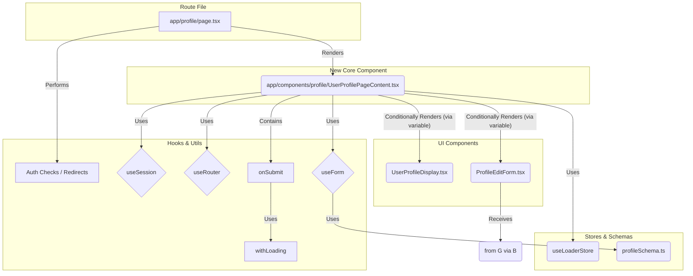

# Profile Page Refactoring Plan (Updated)

## Goal

Refactor `app/profile/page.tsx` to:
1.  Extract the core UI and logic into a dedicated component (`UserProfilePageContent.tsx`).
2.  Replace the local loading state with the global `useLoaderStore`.
3.  Keep the existing Zod schema for client-side validation.
4.  Apply the preferred style of using variables for conditional JSX rendering.

This improves separation of concerns, leverages the global loading state, and maintains consistent coding style.

## Steps

1.  **Create New Component (`UserProfilePageContent.tsx`):**
    *   Create a new file: `app/components/profile/UserProfilePageContent.tsx`.
    *   Make it a client component (`'use client';`).
    *   Move the following from `app/profile/page.tsx` into this new component:
        *   Imports for `useState`, `useEffect`, `useSession`, `useRouter`, `useToast`, form components, display component, schema/type, etc.
        *   The `isEditing` state (`useState(false)`).
        *   The `useForm` hook setup, including `zodResolver` and `defaultValues`.
        *   The `useEffect` hook that resets the form based on the session.
        *   The `onSubmit` function (handling the API call).
        *   The main JSX return structure (the `Card` containing profile content).
    *   **Style Update:** Inside this component, use a variable (e.g., `profileContent`) to hold the JSX for either `<ProfileEditForm />` or the `<UserProfileDisplay />` block based on the `isEditing` state. Render this variable within the main `return` statement's `<CardContent>`.

2.  **Refactor `app/profile/page.tsx`:**
    *   Keep it as a client component (`'use client';`).
    *   Keep the initial `useSession` and `useRouter` hooks for auth checks.
    *   Keep the loading state check (`status === 'loading'`).
    *   Keep the authentication checks (`status === 'unauthenticated'` or `!session?.user`) and the `router.push('/login')` logic.
    *   Remove all the logic moved to `UserProfilePageContent.tsx`.
    *   After the authentication checks pass, import and render the new `<UserProfilePageContent />` component.

3.  **Integrate Global Loader (`useLoaderStore`):**
    *   In `UserProfilePageContent.tsx`:
        *   Import `useLoaderStore` from `lib/stores/loaderStore.ts`.
        *   Get `withLoading` and `isLoading` from the store: `const { withLoading, isLoading } = useLoaderStore();`.
        *   Remove the local `isLoading` state (`useState`).
        *   Modify the `onSubmit` function to wrap the core logic inside the `withLoading` helper.
        *   Pass the `isLoading` state from `useLoaderStore` as a prop to `<ProfileEditForm isLoading={isLoading} />`.

4.  **Zod Usage:**
    *   Keep the Zod schema (`profileSchema.ts`) and its integration via `zodResolver` in `UserProfilePageContent.tsx`.

## Visualized Structure

## Summary of Changes

*   `app/profile/page.tsx`: Becomes a lightweight wrapper handling auth and rendering the main content component.
*   `app/components/profile/UserProfilePageContent.tsx`: New component containing the core profile logic, state management (excluding loading), form handling, and API interaction. Uses the global loader and variable-based conditional rendering.
*   `lib/stores/loaderStore.ts`: Used for loading state.
*   `app/components/profile/ProfileEditForm.tsx`: Receives `isLoading` from the global store via its parent.
*   `app/components/profile/profileSchema.ts`: Remains unchanged and continues to provide validation.